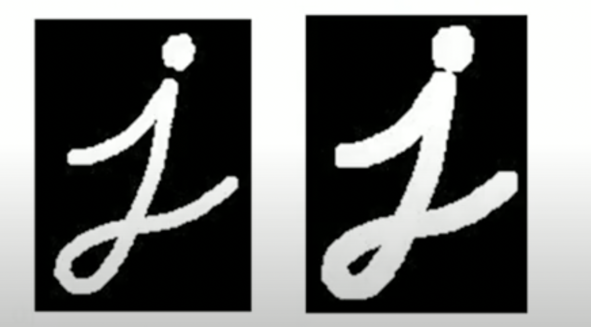
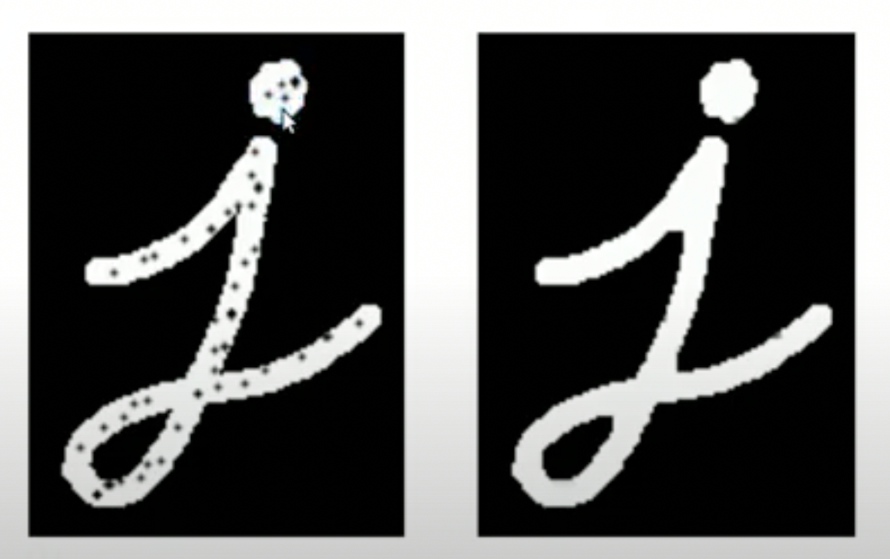

### Erosion

- A pixel in the original image (either 255 or 0) will be considered 255 only
  if all the pixels under the kernel is 255, otherwise it is eroded (made to
  zero).
- Make image thinner

### Dilation

- Just Opposite of Erosion Here, a pixel element is '255'
  if atleast one pixel under the kernel is '255'.
- Make image thicker

### Opening

- Erosion followed by Dilation!
  Many times used in Noise Removal !

### Closing

- Reverse of Opening (Dilation followed by Erosion)

### Gradient (Edge)

- Dilated Image - Eroded image (thicker - thinner)
- To find outlines of Objects

### Top Hat

- Difference between Input Image and its opening
- Highlights minor details in image (only)

### Black Hat

-Closing Input Image

- To find bright objects on dark background

